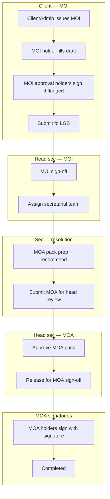

# User roles, hierarchy & system flow

LGB Services has **4 active login roles**. Internal users can also have **permission flags** — overlays on `Admin` / `User`, not separate roles.

**Terminology in this doc:**
- **Sec (internal)** = secretarial staff only (`User` role without approval hats: Ng Poh Li, Siti, Nadia, etc.)
- **External** = everyone who is **not** sec — client companies **and** LGB non-sec people (head secretary, CFO, division approvers, etc.)

**Full document (PDF):** [USER_ROLES.pdf](./USER_ROLES.pdf)  
**Regenerate PDFs:** `python3 docs/build-user-roles-pdf.py` (from repo root)

---

## 1. Active roles (4)

| # | Role | Side | Scoped to | Typical UI |
|---|------|------|-----------|------------|
| 1 | **Admin** | LGB | All customers | Dashboard, customers, packages, admin, workflow config |
| 2 | **User** | LGB | Jobs assigned to them | My work tracker, assigned package lines, forms |
| 3 | **ClientAdmin** | Customer | One `CustomerId` | Client portal, packages, team & signatories |
| 4 | **ClientSignatory** | Customer | One company + their name on forms | **My documents** only |

---

## 2. Internal permission overlays

| Flag | Who typically | What it does |
|------|----------------|--------------|
| `CanApproveMoiIntake` | Sharon, intake approvers | Review client-submitted MOI; sign-off or reject |
| `CanApproveMoi` | Sharon | **MOI sign-off** after client submission |
| `CanRecommendMoi` | Division recommenders | Recommend MOI after sec prep |
| `CanApproveMoa` | Sharon | MOA head review, release to signatories, MOA pack approval |
| `IsInternalSignatory` | Named LGB approvers | Optional workflow step assignees (when sequential MOA UI enabled) |

---

## 3. Account holder flags (customer creation)

| Checkbox | When they act |
|----------|----------------|
| **MOI** | Fill / submit the MOI form |
| **Needs MOI Approval** | Approve the MOI **before** LGB sees it (client phase) |
| **MOA** | Sign the MOA when released for sign-off (parallel; all required) |

---

## 4. End-to-end pipeline (implemented)

**There is no separate “execution” phase.** When all required MOA holders have signed, the package line is **Completed**.

---

## 5. Step-by-step (display status)

| Step | Status (examples) | Primary actor |
|------|-------------------|---------------|
| Package synced | MOI not received | Admin creates customer |
| Client starts MOI | MOI not received / draft | ClientAdmin + MOI holder |
| Client MOI approval | Pending client approval | MOI approval holders |
| Submitted to LGB | With LGB for review | — |
| MOI sign-off | Assign secretarial team | `CanApproveMoi` / intake |
| Sec assigned | Resolution prep | Admin assigns sec team |
| Sec prep | Resolution prep / Pending recommendation | Sec (`User`) |
| MOA pack | MOI approved (internal) | Sec prepares MOA |
| Head MOA review | MOI sign-off (internal) | `CanApproveMoa` |
| Released | Ready for MOA | `CanApproveMoa` |
| Client MOA sign | MOA circulation | MOA-flagged account holders |
| Done | Completed | Last MOA signature |

---

## 6. MOA workflow templates (Option C)

- **Division group** sets default template (`MOA_NO_LOA`, `MOA_WITH_LOA`, `MOA_SWM`).
- **Customer** may override via **MOA workflow template** on create/edit.
- Template + MOA form flags (`financeRelated`, `bankSignatory`, LOA) control which approval **sections** appear on the MOA form.
- **MOA holders** (customer creation checkbox) sign in parallel via client portal; all required signatures → **Completed**.
- Admin may edit templates under **Settings → Workflow config**.

---

## 7. Customer onboarding

- Packages from catalog or **Add-ons only** (non-COSEC).
- Optional **package fee override** per row.
- Auto `ClientAdmin` + `ClientSignatory` accounts from account holders.
- Billing parties (Invoice By / Charge To).

---

## 8. Seed accounts (Development)

Password: `password123` (change on first login).

| Email | Role |
|-------|------|
| `sharon@lgb.test` | Admin — MOI sign-off, MOA review, assign sec |
| `ngpohli@lgb.test`, `siti@lgb.test`, etc. | User (sec) |
| `clientadmin@acme.test` | ClientAdmin |
| `dra@lgb.test`, `dra2@lgb.test`, `dra3@lgb.test` | ClientSignatory |

---

## Code references

| Area | Path |
|------|------|
| Handoff states | `LGBApp.Backend/Services/JobHandoffService.cs` |
| Status labels | `LGBApp.Backend/Services/PackageItemStatusResolver.cs` |
| Sec assignment | `LGBApp.Backend/Services/JobRequestAssignmentService.cs` |
| MOA templates (UI) | `LGBApp.Frontend/src/lib/moaTemplateSections.ts` |
| Frontend status | `LGBApp.Frontend/src/lib/packageItemStatus.ts` |
